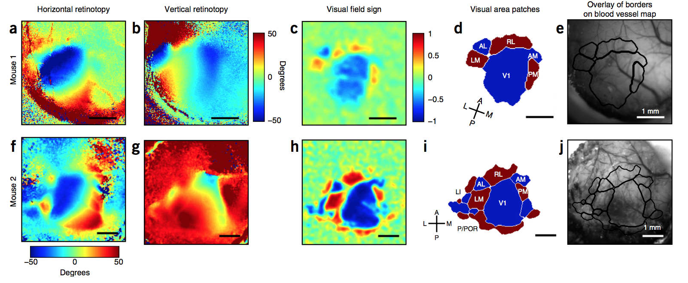

About
=======
The retinotopic mapping package is a self-contained module
for performing automated segmentation of the mouse
visual cortex. The experimental setup and analysis routine was
modified from Garrett et al. 2014 (1), and closely follows
the protocols and procedures documented in Juavinett et al. 2017
(2). 

The code base contains several stimulus routines which are 
highly customizable and designed to give the user significant
flexibility and control in creative experimental design. There
are two distinct but connected aspects to the package:

1. an online experimental component comprised of the 
:mod:`MonitorSetup`, :mod:`StimulusRoutines`, and :mod:`DisplayStimulus` 
modules

2. an offline automated analysis component provided
by the :mod:`RetinotopicMapping` module

.. figure:: images/vasculature.png

What is a retinotopic map?
++++++++++++++++++++++++++
Retinotopic maps are a common tool used in systems 
neuroscience to understand how receptive fields are
mapped onto particular regions of the brain. In the lower visual
areas of certain species, neurons are organized as a 2D representation 
of the visual image that is formed on the retina. 

   Image taken from (2) in :ref:`citations`.

Contributors
+++++++++++++
* Jun Zhuang @zhuang1981
* John Yearsley @yearsj
* Derric Williams @derricw

.. _citations:

Citations
++++++++++
1. Garrett ME, Nauhaus I, Marshel JH, Callaway EM (2014) Topography and 
areal organization of mouse visual cortex. J Neurosci 34:12587-12600.

2. Juavinett AL, Nauhaus I, Garrett ME, Zhuang J, Callaway EM (2017). 
Automated identification of mouse visual areas with intrinsic signal 
imaging. Nature Protocols. 12: 32-43.